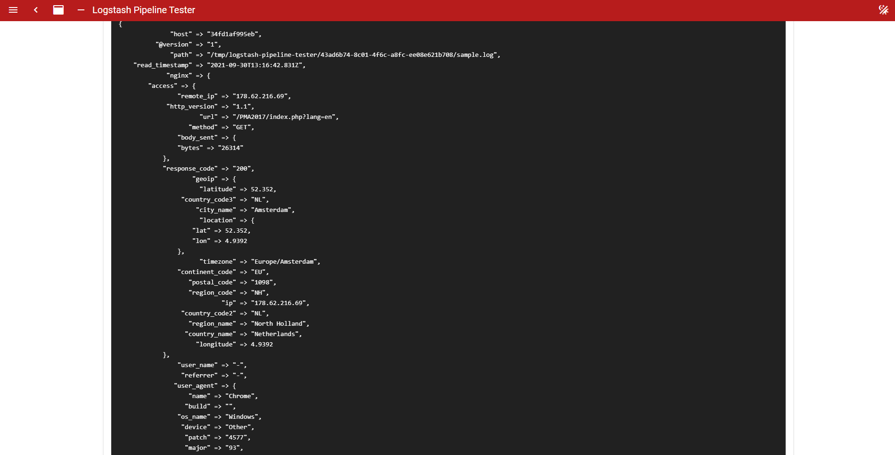

# Logstash Pipeline Tester

## Usage

When using this app, you only need to input the `filter` step for the logstash pipeline, you need to exclude the `input` and `output` steps like and example below.




## Docker

You can use it directly from https://hub.docker.com/r/misbahulard/logstash-pipeline-tester.

If you need to modify the `config.yaml` file you need to mount your config file to `/etc/logstash-pipeline-tester/config.yaml`.

## Developing

You need to run separate application for backend and frontend.

### Run Backend

run the golang app as usual

```
go run main.go
```

or using the `air`, for hot reload https://github.com/cosmtrek/air.

```
air
```

### Run Frontend

change your active directory to `web/logstash-pipeline-tester`, and run the `yarn` command.

```
yarn dev
```

If you want to build the nuxtjs, just need to run.

```
yarn build
```

### Building Binary

```
make build

```

## Sample Pipeline and Logs

Here is sample to test the program.

pipeline:

```
filter {
    grok {
        match => {
            "message" => ["%{IPORHOST:[nginx][access][remote_ip]} - %{DATA:[nginx][access][user_name]} \[%{HTTPDATE:[nginx][access][time]}\] \"%{WORD:[nginx][access][method]} %{DATA:[nginx][access][url]} HTTP/%{NUMBER:[nginx][access][http_version]}\" %{NUMBER:[nginx][access][response_code]} %{NUMBER:[nginx][access][body_sent][bytes]} \"%{DATA:[nginx][access][referrer]}\" \"%{DATA:[nginx][access][agent]}\""] 
        }
        remove_field => "message"
    }

    mutate {
        add_field => { "read_timestamp" => "%{@timestamp}" }
    }

    date {
        match => [ "[nginx][access][time]", "dd/MMM/YYYY:H:m:s Z" ]
        remove_field => "[nginx][access][time]"
    }

    useragent {
        source => "[nginx][access][agent]"
        target => "[nginx][access][user_agent]"
        remove_field => "[nginx][access][agent]"
    }

    geoip {
        source => "[nginx][access][remote_ip]"
        target => "[nginx][access][geoip]"
    }
}
```

nginx access logs:

```
178.62.216.69 - - [30/Sep/2021:11:34:47 +0000] "GET /PMA/index.php?lang=en HTTP/1.1" 200 26314 "-" "Mozilla/5.0 (Windows NT 10.0; Win64; x64) AppleWebKit/537.36 (KHTML, like Gecko) Chrome/93.0.4577.82 Safari/537.36" "-"
137.184.103.41 - - [30/Sep/2021:11:35:22 +0000] "GET /system_api.php HTTP/1.1" 200 6965 "-" "Mozilla/5.0 (Windows NT 10.0; Win64; x64) AppleWebKit/537.36 (KHTML, like Gecko) Chrome/74.0.3729.169 Safari/537.36" "-"
178.62.216.69 - - [30/Sep/2021:11:34:48 +0000] "GET /phpMyAdmin-3/index.php?lang=en HTTP/1.1" 200 26314 "-" "Mozilla/5.0 (Windows NT 10.0; Win64; x64) AppleWebKit/537.36 (KHTML, like Gecko) Chrome/93.0.4577.82 Safari/537.36" "-"
```